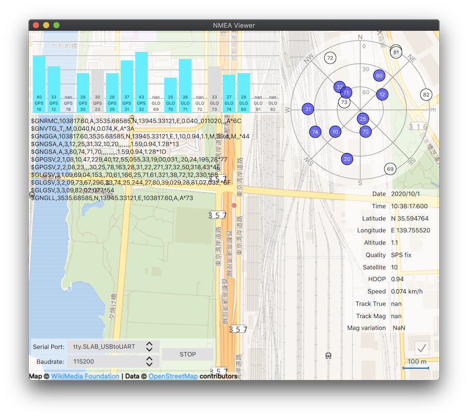

# NmeaPrint
NMEA Viewer for GNSS module

## 概要
USBでつないだGNSSが出力する情報を眺めるツールです。
ログを取ったりする機能はありません。

## Screenshot

## ビルド環境
* Qt 5.12.9
* Qt 5.15.1

## 実行環境
* macOS 10.15.6
* WinとLinuxはそのうち対応

## 動作デバイス
* uBlox M8030-KT
* NMEA 0183 Ver.4.XX に対応していれば多分動きます。

## セットアップ
USB CDC (Communications Device Class)に対応したGNSSを接続します。
（必要であればUSBドライバを事前にインストールしておきます。）

## 使用方法
ビルドした実行ファイルを起動します。
ポートとボーレートを設定し、スタートボタンを押します。

右下のチェックボックスをオンにすると、現在地が中心になります。